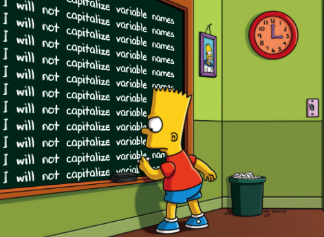

# **Bart's detention.**

---

Bart's teacher wants him to write lines on the chalkboard.



He needs to write this paragraph 6 times:

`I will not copy and paste code.`

`I will use Camel Case when writing class names.`

`I will use lower Camel Case when writing function names.`

`I will use lower Camel Case when writing variables names.`

Bart wrote the paragraph once, but it took him a long time!

# **Task 1 - Write a function**

Help Bart write a function that does the task for him.

- The name of the function is `printLines`.

# **Task 2 - Call the function**

Once you finish writing it, call the function six times.

# **Run your code.**

```
   >>I will not copy and paste code.
   >>I will use Camel Case when writing class names.
   >>I will use lower Camel Case when writing function names.
   >>I will use lower Camel Case when writing variables names.

   >>I will not copy and paste code.
   >>I will use Camel Case when writing class names.
   >>I will use lower Camel Case when writing function names.
   >>I will use lower Camel Case when writing variables names.

   >>I will not copy and paste code.
   >>I will use Camel Case when writing class names.
   >>I will use lower Camel Case when writing function names.
   >>I will use lower Camel Case when writing variables names.

   ...
```
